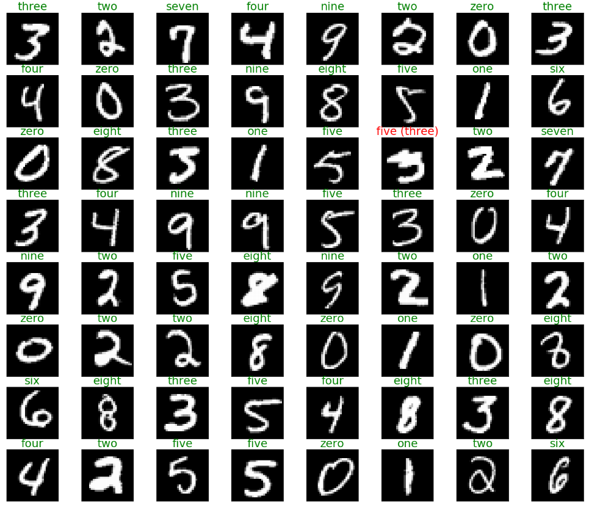
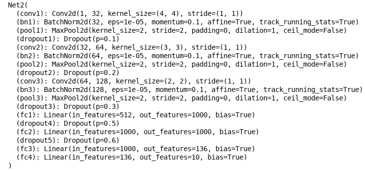
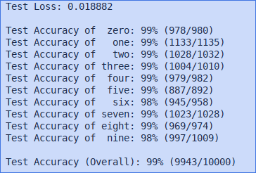

This is a simple MNIST demonstration using a neural network that is loosely based on [Naimishnet CNN](https://arxiv.org/pdf/1710.00977.pdf).
The results were very good, but this is mostly used as a `Hello World`

# Requirements
Python 3.x
numpy
pytorch with cuda92

# Network
There are a few basic networks in `model.py`, but Net2 achieved the best results.

# Results
When run using 60000 training images, a batch size of 64, and 1000 epochs.

Training did not seem to overfit based on the loss over time, but the extent of was not fully explored.

The accuracy is very high, but there are still a number of images that were predicted incorrectly 

